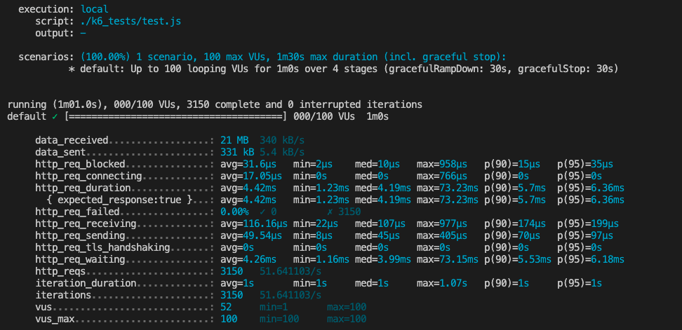

An exercise in system design working within a large team.

## Approach
Recieving a clientside component from the Frontend Development Team, my team has been tasked with replicating the Atelier API that supplies live and persistent data to the clientside of our storefront. We experimented with several different scaling strategies and fault tolerance designs. In the end, we decided to break the Atelier API into several smaller microservices. Smaller mimcroservice foot prints decreased instances deployment costs, while also ensuring resiliance in the event of unexpected back end downtime. Once each microservice had been thoroughly stress tested, we would use NGINX load balancing instances in front of each microservice in order to combine them.

### Process:
Daily standups were obvserved along with 3 day sprint iterations. The team met regularly to discuss hurdles and share strategies often working in a pair programming setting. 
  1.  Database Modelling: 
After some brief research we determined that a relational database would better suit the use case of an online store. Ultimately, we decided on implementing Postgres due to team members previous experiene with ETL processes in the pg environment.

  2. Local Testing: After the local backend was stood up, we commenced testing query times by directing queries at the last 10% of our entries. The team colloborated by looking doublechecking each others query methods. Testing was directed at the last 10% of our tables with random data in order to weed out any time loss from unexpected sequential scans or inefficient joins.

  3. First bottleneck: We observed significant slowdown within our node server, due to reformatting query results into the correct shape for clientside consumption. Collectively, the team decided it was worth spending an extra sprint cycle to refactor our database queries using json_agg functions within postgres. Correctly forming the data within the postgresql instance lead to a dramatic reduction in response times. (C runs much faster than JS... duh!)
  4. Second BottleNeck: Despite correctly forming responses, we were still seeing local response times in excess of 300ms... A closer look revealed that our established ETL process used the psql command line. When performing ETL in PgAdmin, establishing foreign key constraints automatically created secondary indexes to maintain constant time lookups. HOWEVER! Doing the same process through the psql cli did not automatically create our secondary indexes on FKs. 

__Returning to k6 now, our results matched our expectations of less than 10ms per query.__

## Deployment:
We chose to use AWS EC2 micro.t2 instances in order to accommodate our lean deployment budget ( *COUGH COUGH ZERO DOLLARS* ).

After deploying single instances, we leaned on loader.io to fire increasing requests per second, until we noticed degraded response times or errors in excess of 3%. Response time was rock solid at 62-64ms until requests per second began creeping above 1500RPS per instance.

## Scaling: 
After discovering the limitation of a single instance, we horizontally scaled to 5 micro-service workers and used experimented with several load balancing strategie s with an NGNX instance coordinating our increased traffic. We found that using a "least connected" strategy in this orientation was slightly faster than the default "round-robin" approach. 

Further testing was able to meet our intitial goal of high durability and fault tolerant service of up to 8000 RPS with 0% error rate and sub 100ms response times.

# Revisiting
This exercise was illuminating on many fronts, but most importantly I would like to revisit and work on...

* More thorough Docker implementation to enable rapid deployment
* WASL and maintaining concurrancy in multiple databases instances during heavy WRITE loads.
