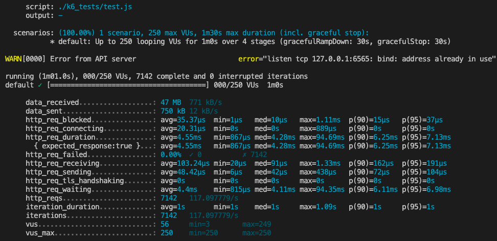
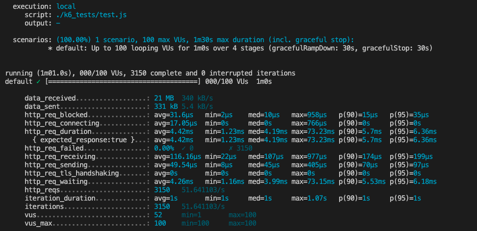
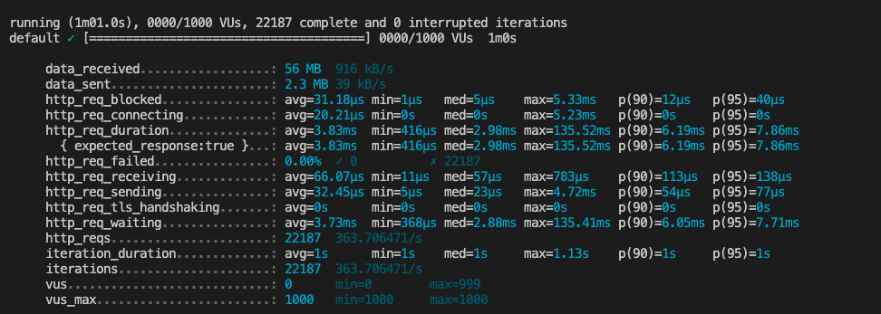

# Day 6

## Previous work summary
  * Finished structuring DB and all queries.
  * Queries now use robust aggs to format data correctly within the query. This alleviates CPU stress on the server.
  * Setup K6 with several tests to each endpoint. Tests use randomized parameters and ramps up to 1000RPS

  
  
  

  ## Challenges
    * Struggled with understanding what http-blocking and http-waiting time metrics meant in k6
    * Struggled with proper structuring of stress tests in k6.
    * Struggled with contextual understanding of metrics. Is 67ms req_duration good? bad? average?

  ## Actions
    * Tons of reading in k6 documentation and supplemented with detail differences between node:dev and node:prod modes.
    * Realized that without ramping test requests, I was essentially spiking my server load from request 1. This resulted in
    a 1-2second request time for the initial spike. These increases pulled my request average up over the course of testing.
    * Implementing proper ramping of requests during load tests provided more informative metrics to consider.
    * Swithching the node express server to production mode, alleviated tcp request limits that were increasing http-blokcing times.
    As far as I currently understand, node in development limits the amount of active connections, and works with the tcp queue in a
    more restricted manner. ** More Reading needs to be done here **

  ## Results
    * Applying the changes listed above, while also doing the majority of data formatring directly in SQL was able to reduce my
    request durations to an averagee of 3ms at 1000RPS. I still may not be ramping correctly, as a few requests are maxing out around 1 second.
    * Realized my (at the time) excessive amount of energy forming the "perfect SQL query" might not have been such a huge waste after all.
    Many of my peers are seeing increased server load due to formatting multiple SQL requests, but I hope I can take advantadge of that efficiency
    when the server ends up getting deployed.